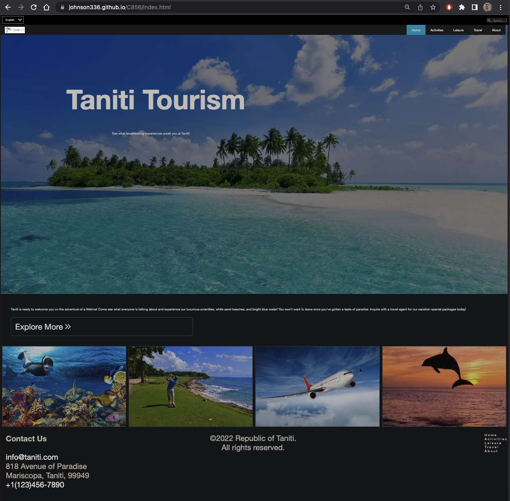

# C856 Website Project #

Link: [https://johnson336.github.io/C856/](https://johnson336.github.io/C856/)

This website is a project for WGU BS - Software Development course C856. It is a demonstration tourism website for the fictional island of Taniti. It was created to demonstrate competence in the following web design concepts:
  - Responsive UX Design
  - Usability Testing
  - Guerilla Testing
  - HTML
  - CSS
    - Transitions
    - Animations
    - Keyframes
    - 2D Transforms

The site is hosted at [https://johnson336.github.io/C856/](https://johnson336.github.io/C856/).